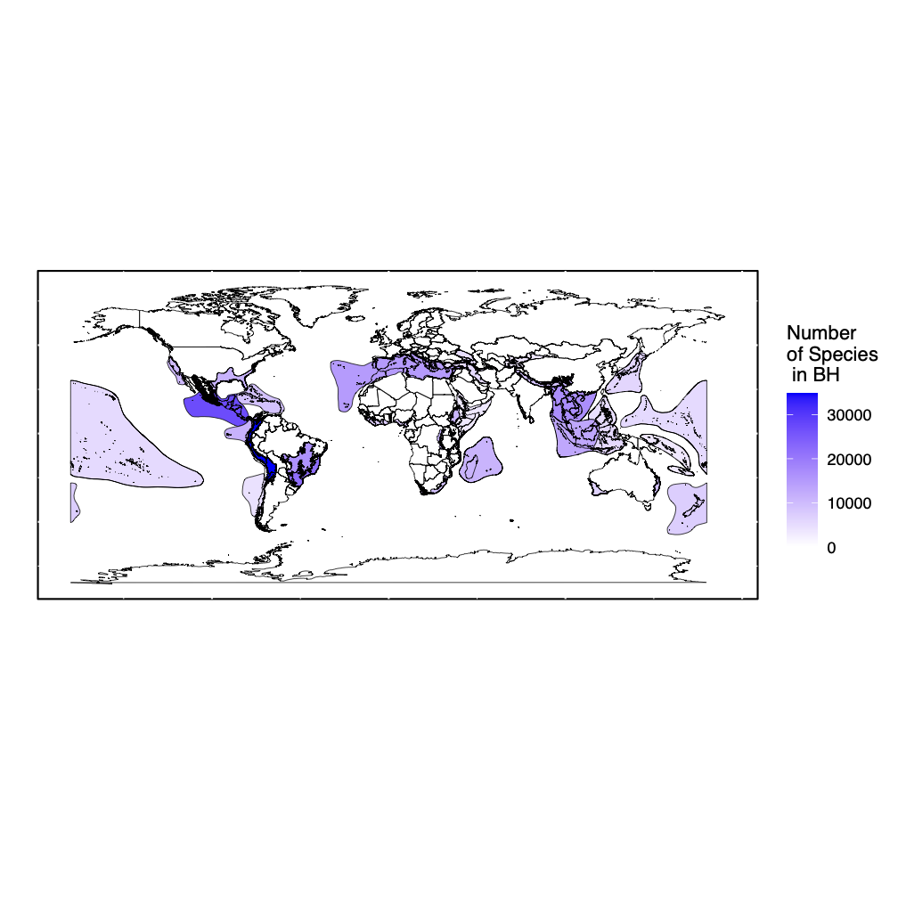
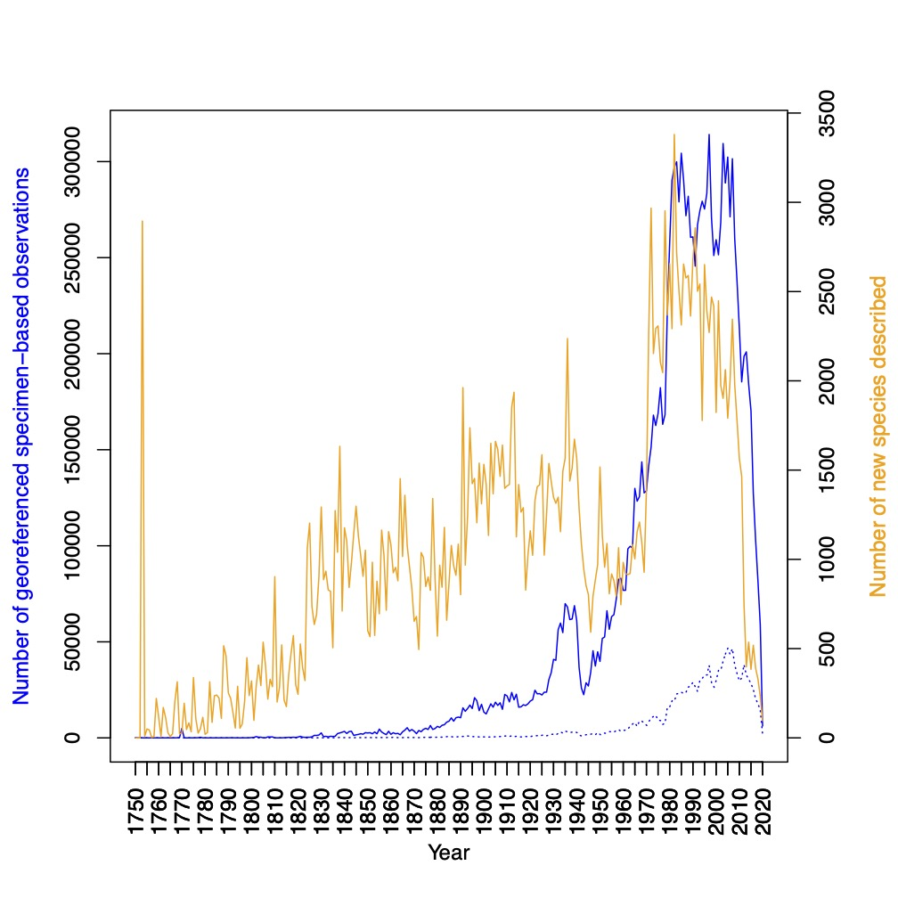
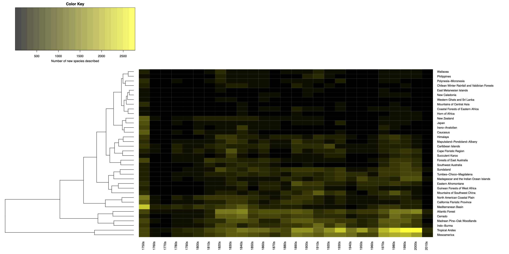
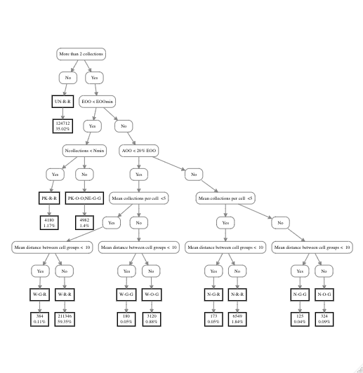

```{js logo-js, echo=FALSE}
$(document).ready(function() {
  $('#header').parent().prepend('<div id=\"logo\"></div>');
  $('#header').css('margin-right', '120px')
});
```

```{r packages, echo=FALSE, warning=FALSE, include=FALSE}
library(knitr)
library(rmarkdown)
library(bookdown)
#library(distill)
library(knitcitations)
library(formatR)
library(devtools)
library(kfigr)
library(dplyr)
library(kableExtra)
library(tufte)

#Generate BibTex citation file for all R packages used to produce report
knitr::write_bib(.packages(), file = 'packages.bib')
```


```{r setup, include=FALSE}
knitr::opts_chunk$set(echo = TRUE)
```


# Data Availability

The input data (all tracheophyta restricted to only those with a physical specimen with GPS coordinates) can be accessed directly from GBIF:

[Click Here to See GBIF Data](https://doi.org/10.15468/dl.xfcbqv)

The 2021 ReproChecklist can be downloaded in the link below:

[Click Here to Get 2021 ReproChecklist](https://doi.org/10.6084/m9.figshare.13720318)

A folder of intermediate files can be downloaded in the link below:

[Click Here to Get Intermediate Data](https://drive.google.com/drive/folders/1pIzb27PKIq0_iA2Lz0p7vjTvPWISEkXQ?usp=sharing)

# Package Availability
You can download the *ReproChecklist* package from GitHub using the install_github package from devtools
```{r, eval = FALSE}
install.packages("devtools")
devtools::install_github("wojahn/ReproChecklist")
```

# Preprocess raw GBIF file into smaller files
After downloading GBIF raw file we need to preprocess it so that we can work within the confines of 16 GB RAM

```{r, eval = FALSE}
# Make intermediate
#Make intermediate
system("cut  -f 1,6,9,10,22,23,33,41,45 0160938-200613084148143.csv > GBIF_Traceophyta_2021Small.tab")
#Move original to external drive or delete it to conserve memory
#From intermediate make singles
system("cut  -f 1 GBIF_Traceophyta_2021Small.tab > gbifID.tab")
system("cut  -f 2 GBIF_Traceophyta_2021Small.tab > class.tab")
system("cut  -f 3 GBIF_Traceophyta_2021Small.tab > genus.tab")
system("cut  -f 4 GBIF_Traceophyta_2021Small.tab > species.tab")
system("cut  -f 5 GBIF_Traceophyta_2021Small.tab > dLat.tab")
system("cut  -f 6 GBIF_Traceophyta_2021Small.tab > dLong.tab")
system("cut  -f 7 GBIF_Traceophyta_2021Small.tab > year.tab")
system("cut  -f 8 GBIF_Traceophyta_2021Small.tab > IDdBy.tab")
system("cut  -f 9 GBIF_Traceophyta_2021Small.tab > RecrdedBy.tab")
system("cut  -f 1,7 GBIF_Traceophyta_2021Small.tab > gbifYearandID.tab")
system("cut  -f 1,4 GBIF_Traceophyta_2021Small.tab > IDandSpp.tab")
system("cut  -f 1,46 0160938-200613084148143.csv > IDandType.tab")
```

# Inferring raw hotspot species list
We downloaded occurrence data for Tracheophytes (vascular plants) with physical specimens from GBIF on 8 September 2020 (GBIF, 2020).  A database of species occurring in the 36 BHs was inferred by the function HotspotOverlappeR using overlapping points derived from GBIF GPS data with shapefiles of the 36 hotspots (CEPF, 2016). The names of the hotspot(s) in which each taxon occurred were also recorded by the function. HotspotOverlappeR used maptools (Bivand et al., 2019) and sp (Pebesma et al., 2005).

```{r, eval = FALSE}
# Read in coordinate data, GBIF IDs, and species
GBIFlat <- read.delim("dLat.tab", sep = "\t")
GBIFlong <- read.delim("dLong.tab", sep = "\t")
GBIFidspp <- read.delim("IDandSpp.tab",sep="\t") #bc spp sometimes has tabs between them
# Make file for overlapping
ForOverlapping <- data.frame(GBIFidspp,GBIFlat,GBIFlong)
# Destroy old variables to conserve RAM
rm(c(GBIFidspp,GBIFlat,GBIFlong))
gc()
# Overlap with hotspots shapefile
HotspotsSpp <- ReproChecklist::HotspotOverlappeR(ForOverlapping)
write.csv(HotspotsSpp,"HotspotSpp.csv",row.names=F)
# Restrict to only species in hotspots
TrueHotspotSpp <- HotspotsSpp[!is.na(HotspotsSpp$InHotspot),]
write.csv(TrueHotspotSpp,"TrueHotspotSpp.csv",row.names=F)
# Remove old variables to conserve memory
rm(HotspotsSpp)
gc()

```

# Curate taxonomy
This database was then taxonomically curated using the TPL_Synonym_CheckeR, WFO_Synonym_CheckR and TaxonomyHarmonizeR functions from our package Geochecklist.  Taxonomical curation prioritized the nomenclature of the more recently updated World Flora Online (WFO, 2020) while using the more comprehensive (but older) The Plant List (TPL, 2013) for taxa not in the WFO.

```{r, eval = FALSE}
# Make unique list of all species-level occurrences
UniqueHSpp <- unique(as.vector(TrueHotspotSpp$Species))
# Remove non-BH occurrences
UniqueHSpp <- UniqueHSpp[!UniqueHSpp == ""]
# Compare taxonomy with The Plant List
TPL_Curated <- ReproChecklist::TPL_Synonym_CheckeR(as.character(UniqueHSpp))
write.csv(TPL_Curated,"TPL_Curated.csv",row.names = F)
# Compare taxonomy with World Flora Online
WF_Curated <- ReproChecklist::WFO_Synonym_CheckeR(as.character(UniqueHSpp))
write.csv(WF_Curated,"WF_Curated.csv",row.names = F)
# Harmonize taxonomy between TPL and WFO, prioritizing WFO
CuratedHSpp <- ReproChecklist::TaxonomyHarmonizeR(TPL_Curated, WF_Curated, UniqueHSpp)
write.csv(CuratedHSpp,"CuratedHSpp.csv",row.names = F)
# Now apply this harmonized taxonomical framework to GBIF species
UpdatedGBIFHSpp <- ReproChecklist::GBIFTaxonomicalHarmonizeR(TrueHotspotSpp,CuratedHSpp)
# Update column name
colnames(UpdatedGBIFHSpp)[6] <- "GBIF_ID"
write.csv(UpdatedGBIFHSpp,"UpdatedGBIFHSpp.csv",row.names=F)
# Remove occurrences with empty taxonomical information
 ReproChecklist <- as.data.frame(UpdatedGBIFHSpp[!UpdatedGBIFHSpp$Species == "",])
 write.csv(ReproChecklist,"ReproChecklist.csv",row.names=F)
```


# Calculate number of collections per species, number of collections total, and skewness statisitics as well as number of species unique to each hotspot

The number of species in each BH was inferred using the function HotspotSpeciesCounteR using the outputs of HotspotOverlappeR and TaxonomyHarmonizeR. It also inferred the number of total collections per hotspot, the median number of collections per species in each hotspot, the standard deviation of the number of collections per species in each hotspot, and the Pearson’s moment coefficient of skewness of the number of collections per species in each hotspot. It used EnvStats internally (Millard, 2013). The percent of species unique to each hotspot was calculated by SharedSpeciesInferreR.

```{r, eval = FALSE}
out <- ReproChecklist::HotspotSpeciesCounteR(ReproChecklist)
write.csv(out,"HotspotSppInfo.csv",row.names=F)
SharedSpecies <- ReproChecklist::SharedSpeciesInferreR(ReproChecklist)
write.csv(SharedSpecies,"SharedSpecies.csv",row.names=F)
# Make species richness BH world map
ReproChecklist::SpeciesRichnessMapMakeR()
```

Here is the BH species richness map:

<center>
[]()
</center>

# Extract year of description using IPNI
	
Next we extracted the dates of description for each of the species in the curated list as well as for names that were eliminated during curation was done using the function IPNI_Description_Date_GetteR.  This function used taxize (Chamberlain et al., 2013) internally.  If a taxon in the curated list was not in IPNI but its synonym was, then its synonym’s date of description was used as its date of description.  If multiple dates were returned the earliest date was used as the date of description. This process was done by the functions IPNITaxonomyHarmonizeR and IPNICleaneR in our package.
```{r, eval = FALSE}
# Make unique vector of all hotspot species
AllHSpp <- unique(as.vector(c(as.character(CuratedHSpp$AcceptedName),as.character(CuratedHSpp$OldName))))
# Set entrez key (this one is depreciated, use your personal key)
rentrez::set_entrez_key("XXXXXXXXXXXXXXXXXXXXXXXXXXXXXXXXX")
# Get description dates
IPNIyears <- ReproChecklist::IPNI_Description_Date_GetteR(as.character(AllHSpp))
write.csv(IPNIyears,"IPNIyears.csv",row.names=F)
# Harmonize IPNI taxonomy with curated list
FinalIPNI <- ReproChecklist::IPNITaxonomyHarmonizeR(IPNIyears,CuratedHSpp)
write.csv(FinalIPNI,"FinalIPNI.csv", row.names=F)
# Do some stats
length(which(FinalIPNI$DescriptionYear == "NOT_IN_IPNI"))
UniqueAccepteds <- unique(as.vector(CuratedHSpp$AcceptedName))
length(UniqueAccepteds)
```


# Make collection and description yearly curves

Then we analysed the GBIF collection year data for all of the hotspot species by constructing curves illustrating the number of collections per year.  The same process was done for the IPNI year-of-description data, where the curve showed the number of descriptions per year.  The function YearlyCollectionDescriptionPlotsMakeR performed this analysis for the overall data and coplotted the 2 resultant curves.  Regressions were run on the collection and description data from 2009 to 2020 for collections and descriptions using RegressionPerformeR.

```{r, eval = FALSE}
#set output directory if want it to be different than pwd
ID_Year <- read.delim("gbifYearandID.tab", sep = "\t")
ReproChecklist::YearlyCollectionDescriptionCurvesMakeR(ReproChecklist,FinalIPNI,ID_Year)

```

Here are the yearly collection and description curves (blue is collection, orange is description, dotted is genus-only collections):

<center>
[]()
</center>

# Make hotspotwise heatmaps
Heatmaps of collection activity and description activity were generated using HeatmapMakeR.  This function used gplots (Gregory et al., 2020) internally to create the heatmap and perform the clustering analyses. Labels were colored using visual inspection of clusters.  Colrownumz and Descrownumz can be added to add group prefixes to the graph. They have the same order as would unique(UpdatedGBIFHSpp$HotspotName) as their first column and the group membership as a number in the second column.

```{r, eval = FALSE}
# Preprocess IPNI results
IPNIReady <- ReproChecklist::IPNIReadieR(FinalIPNI)
write.csv(IPNIReady,"IPNIReady.csv",row.names=F)
# For first time set to null then add cluster order if desired
Colrownumz <- NULL
Descrownumz <- NULL
# Set output directory if want it to be different than pwd
OutDirectory <- getwd()
# Make collection and description heatmaps
ReproChecklist::HeatmapMakeR(IPNIReady,ReproChecklist,OutDirectory,Colrownumz,Descrownumz, ID_Year = ID_Year))
```

Here is the collections heatmap:

<center>
[]()
</center>

Here is the description heatmap:

<center>
[]()
</center>

# Perform decision tree analysis

In order to calculate the levels of the Linnaean and Wallacean shortfalls for each GSB vascular plant species in each BH by running their ReproChecklist occurrences through a decision tree analysis.
	
```{r, eval = FALSE}
#Perform EOO and AOO analyses for each species for each BH
combo <- ReproChecklist::EOO_AOO_AnalyzeR(ReproChecklist,
                                          MinArea = 100,
                                          MinColl = 5, 
                                          AEp = 0.2,
                                          CellDistThresh = 10
                                          samplesize = 500)

#Construct the decision tree proper
Tree <- ReproChecklist::DecisionTreeMakeR(combo)
library(DiagrammeR)
plot(myproj,layout="lay")
#save as image manually
```

# Here is the decision tree:

<center>
[]()
</center>

# Thank you!
## © 2021 Wojahn, Forest, Callmander, and Buerki
