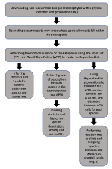

```{js logo-js, echo=FALSE}
$(document).ready(function() {
  $('#header').parent().prepend('<div id=\"logo\"></div>');
  $('#header').css('margin-right', '120px')
});
```

```{r packages, echo=FALSE, warning=FALSE, include=FALSE}
library(knitr)
library(rmarkdown)
library(bookdown)
#library(distill)
library(knitcitations)
library(formatR)
library(devtools)
library(kfigr)
library(dplyr)
library(kableExtra)
library(tufte)

#Generate BibTex citation file for all R packages used to produce report
knitr::write_bib(.packages(), file = 'packages.bib')
```

# Overview

## Research Questions

1.    How many species of vascular plants occur in the 36 BHs and has our knowledge of their distribution been impacted by the decline of GSB observations?
2.    How far are we from completing the description of the BH vascular flora and testing the taxonomy (Linnaean shortfall) and distribution (Wallacean shortfall) of currently-known species? 	

## Overview of our Reprochecklist analysis

To answer our first research question, we created a taxonomically curated database of GSB vascular plant species occurrences in BHs (i.e. the Reprochecklist). We then used this database to infer trends of BH GSB vascular plant species collection and description between BHs and for the BH system as a whole. These trends were visualized as heatmaps (with each BH as a separate row) that were used to analyse differences in collection and description effort between BHs and as rate curves to assess the collection and description trends for the BH system as a whole.
	To answer our second research question, we used a decision tree analysis that assigned to each BH GSB vascular plant taxon one of four levels of uncertainty associated with the Linnaean and Wallacean shortfalls (see Fig. 1 for a flow-chart illustrating the decisions that lead to each of the levels of uncertainty). Decisions were based on the number of collections total, the area of a taxon’s EOO, the area of a taxon’s AOO relative to its EOO, the mean number of collections in a 100 km2 cell, and the mean distance between contiguous groups of occupied 100km2 cells. The percent of species falling into each level of uncertainty was then assessed. This process was conducted for all GSB vascular plant species in the BH system as a whole and also individually just for the GSB vascular plant species in each BH.

<center>
[]()
</center>

# Installing Reprochecklist

## Dependencies

devtools

You can find G2PMineR on GitHub at wojahn/Reprochecklist

```{r, eval = FALSE}
# First install devtools
install.packages("devtools")

# Then install G2PMineR from GitHub
devtools::install_github("wojahn/Reprochecklist")
```

# Author contributions

Conceptualization, J.M.A.W. and S.B.; methodology, J.W.A.W.; software, J.M.A.W.; validation, S.J.G., A.E.M., S.B. and J.M.A.W.; formal analysis, J.M.A.W.; investigation, J.M.A.W.; resources, J.M.A.W.; data curation, J.M.A.W.; writing—original draft preparation, J.M.A.W.; writing—review and editing, S.B., A.M., A.E.M., and S.J.G.; visualization, J.M.A.W.; su-pervision, S.B.; project administration, S.B.; funding acquisition, S.B. All authors have read and agreed to the published version of the manuscript.


<div id="refs"></div>

# Appendix 1 {.appendix}

Citations of all R packages used to generate this report. 

```{r generateBibliography, eval = T, results="asis", cache = F, echo=F, warning = FALSE, message=FALSE}
library("knitcitations")
cleanbib()
options("citation_format" = "pandoc")
read.bibtex(file = "packages.bib")
``` 
