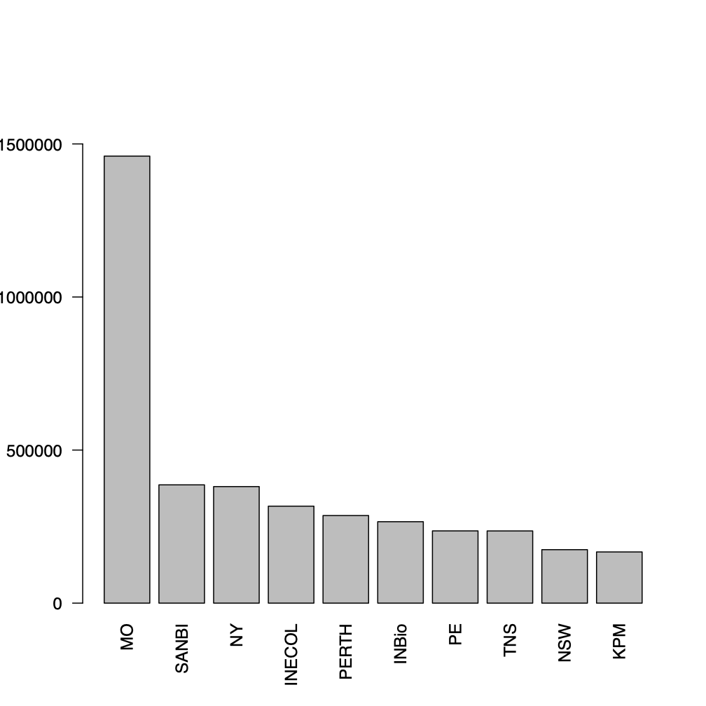
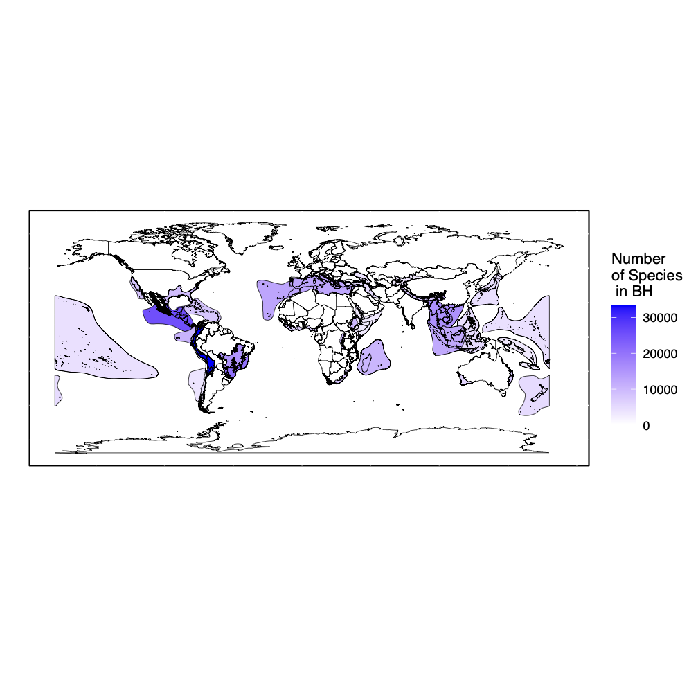

```{js logo-js, echo=FALSE}
$(document).ready(function() {
  $('#header').parent().prepend('<div id=\"logo\"></div>');
  $('#header').css('margin-right', '120px')
});
```

```{r packages, echo=FALSE, warning=FALSE, include=FALSE}
library(knitr)
library(rmarkdown)
library(bookdown)
#library(distill)
library(knitcitations)
library(formatR)
library(devtools)
library(kfigr)
library(dplyr)
library(kableExtra)
library(tufte)

#Generate BibTex citation file for all R packages used to produce report
knitr::write_bib(.packages(), file = 'packages.bib')
```


```{r setup, include=FALSE}
knitr::opts_chunk$set(echo = TRUE)
```


# Data Availability

The input data (all tracheophyta restricted to only those with a physical specimen with GPS coordinates) can be accessed directly from GBIF:

[Click Here to See GBIF Data](https://doi.org/10.15468/dl.xfcbqv)

The 2021 ReproChecklist can be downloaded in the link below:

[Click Here to Get 2021 ReproChecklist](https://doi.org/10.6084/m9.figshare.15040293)

A folder of intermediate files can be downloaded in the link below:

[Click Here to Get Intermediate Data](https://drive.google.com/drive/folders/1pIzb27PKIq0_iA2Lz0p7vjTvPWISEkXQ?usp=sharing)

# Package Availability
You can download the *ReproChecklist* package from GitHub using the install_github package from devtools
```{r, eval = FALSE}
install.packages("devtools")
devtools::install_github("wojahn/ReproChecklist")
```

# Preprocess raw GBIF file into smaller files
After downloading GBIF raw file we need to preprocess it so that we can work within the confines of 16 GB RAM

```{r, eval = FALSE}
# Make intermediate
#Make intermediate
#Make intermediate
system("cut  -f 1,6,9,10,22,23,33,41,45 0160938-200613084148143.csv > GBIF_Traceophyta_2021Small.tab")
#Move original to external drive or delete it to conserve memory
#From intermediate make singles
system("cut  -f 1 GBIF_Traceophyta_2021Small.tab > gbifID.tab")
system("cut  -f 2 GBIF_Traceophyta_2021Small.tab > class.tab")
system("cut  -f 3 GBIF_Traceophyta_2021Small.tab > genus.tab")
system("cut  -f 4 GBIF_Traceophyta_2021Small.tab > species.tab")
system("cut  -f 5 GBIF_Traceophyta_2021Small.tab > dLat.tab")
system("cut  -f 6 GBIF_Traceophyta_2021Small.tab > dLong.tab")
system("cut  -f 7 GBIF_Traceophyta_2021Small.tab > year.tab")
system("cut  -f 8 GBIF_Traceophyta_2021Small.tab > IDdBy.tab")
system("cut  -f 9 GBIF_Traceophyta_2021Small.tab > RecrdedBy.tab")
system("cut  -f 1,7 GBIF_Traceophyta_2021Small.tab > gbifYearandID.tab")
system("cut  -f 1,4 GBIF_Traceophyta_2021Small.tab > IDandSpp.tab")
system("cut  -f 1,46 0160938-200613084148143.csv > IDandType.tab")
system("cut  -f 1,37 0160938-200613084148143.csv > InstCode.tab")
```

# Inferring raw hotspot species list
We downloaded occurrence data for Tracheophytes (vascular plants) with physical specimens from GBIF on 8 September 2020 (GBIF, 2020).  A database of species occurring in the 36 BHs was inferred by the function HotspotOverlappeR using overlapping points derived from GBIF GPS data with shapefiles of the 36 hotspots (CEPF, 2016). The names of the hotspot(s) in which each taxon occurred were also recorded by the function. HotspotOverlappeR used maptools (Bivand et al., 2019) and sp (Pebesma et al., 2005).

```{r, eval = FALSE}
#Read in columns
GBIFlat <- read.delim("dLat.tab", sep = "\t")
GBIFlong <- read.delim("dLong.tab", sep = "\t")
GBIFidspp <- read.delim("IDandSpp.tab",sep="\t") #bc spp sometimes has tabs between them
#Make file for overlapping
ForOverlapping <- data.frame(GBIFidspp,GBIFlat,GBIFlong)
#Destroy old variables to conserve memory
rm(GBIFidspp)
rm(GBIFlat)
rm(GBIFlong)
gc()
#Overlap with hotspots shapefile
HotspotsSpp <- Reprochecklist::HotspotOverlappeR(ForOverlapping)
write.csv(HotspotsSpp,"HotspotSpp.csv",row.names=F)
#Restrict to only species in hotspots
TrueHotspotSpp <- HotspotsSpp[!is.na(HotspotsSpp$InHotspot),]
write.csv(TrueHotspotSpp,"TrueHotspotSpp.csv",row.names=F)
#Remove old variables to conserve memory
rm(HotspotsSpp)
gc()
```

# Curate taxonomy
This database was then taxonomically curated using the TPL_Synonym_CheckeR, WFO_Synonym_CheckR and TaxonomyHarmonizeR functions from our package Geochecklist.  Taxonomical curation prioritized the nomenclature of the more recently updated World Flora Online (WFO, 2020) while using the more comprehensive (but older) The Plant List (TPL, 2013) for taxa not in the WFO.

```{r, eval = FALSE}
#Make unique list of all species-level occurrences
UniqueHSpp <- unique(as.vector(TrueHotspotSpp$Species))
UniqueHSpp <- UniqueHSpp[!UniqueHSpp == ""]
#Compare taxonomy with The Plant List
TPL_Curated <- ReproChecklist::TPL_Synonym_CheckeR(as.character(UniqueHSpp))
write.csv(TPL_Curated,"TPL_Curated.csv",row.names = F)
#Compare taxonomy with World Flora Online
WF_Curated <- ReproChecklist::WFO_Synonym_CheckeR(as.character(UniqueHSpp))
write.csv(WF_Curated,"WF_Curated.csv",row.names = F)
#Harmonize taxonomy between TPL and WFO, prioritizing WFO
CuratedHSpp <- Reprochecklist::TaxonomyHarmonizeR(TPL_Curated, WF_Curated, UniqueHSpp)
write.csv(CuratedHSpp,"CuratedHSpp.csv",row.names = F)
#Now apply this harmonized taxonomical framework to GBIF species
UpdatedGBIFHSpp <- Reprochecklist::GBIFTaxonomicalHarmonizeR(TrueHotspotSpp,CuratedHSpp)
colnames(UpdatedGBIFHSpp)[6] <- "GBIF_ID"
write.csv(UpdatedGBIFHSpp,"UpdatedGBIFHSpp.csv",row.names=F)
 Reprochecklist <- as.data.frame(UpdatedGBIFHSpp[!UpdatedGBIFHSpp$Species == "",])
Reprochecklist <- as.data.frame(Reprochecklist[!Reprochecklist$Species == "FAIL",])
NoAliens <- ReproChecklist::InvasiveSpeciesRemoveR(Reprochecklist)
# CropSpeciesFixed.csv is available at https://doi.org/10.6084/m9.figshare.15046524
CropSpeciesFixed <- read.csv("CropSpeciesFixed.csv") 
Reprochecklist <- ReproChecklist::CropRemoveR(NoAliens)
 write.csv(Reprochecklist,"Reprochecklist_NoAliens_NoCrops.csv",row.names=F)
```

# Create Institutions Bar Chart
This shows the top ten most contributive institutions for the ReproChecklist
```{r, eval = FALSE}
InstCode <- read.delim("InstCode.tab",sep="\t") #bc spp
ReproInst <- InstCode[InstCode$gbifID %in% IDz,2]
TRI <- as.data.frame(table(ReproInst))
TRI <- TRI[!TRI == "",]
TRI <- TRI[!TRI == " ",]
TRI <- TRI[!is.na(TRI),]
TRI <- as.data.frame(TRI[order(TRI$Freq, decreasing = T),])
TRI_top_ten <- as.data.frame(TRI[1:10,])
pdf("InstitutionBarplot.pdf")
barplot(TRI_top_ten$Freq, names.arg = TRI_top_ten$ReproInst, las=2, ylim = c(0,1700000))
dev.off()
```

Here is the institutions bar plot:

<center>
[]()
</center>

# Calculate number of collections per species, number of collections total, and skewness statisitics as well as number of species unique to each hotspot

The number of species in each BH was inferred using the function HotspotSpeciesCounteR using the outputs of HotspotOverlappeR and TaxonomyHarmonizeR. It also inferred the number of total collections per hotspot, the median number of collections per species in each hotspot, the standard deviation of the number of collections per species in each hotspot, and the Pearson’s moment coefficient of skewness of the number of collections per species in each hotspot. It used EnvStats internally (Millard, 2013). The percent of species unique to each hotspot was calculated by SharedSpeciesInferreR.

```{r, eval = FALSE}
out <- ReproChecklist::HotspotSpeciesCounteR(Reprochecklist)
write.csv(out,"HotspotSppInfoNEW.csv",row.names=F)
SharedSpecies <- ReproChecklist::SharedSpeciesInferreR(Reprochecklist)
write.csv(SharedSpecies,"SharedSpeciesNEW.csv",row.names=F)

 HotspotSppInfo <- read.csv("HotspotSppInfoNEW.csv")
  HotspotSppInfo <- data.frame(HotspotSppInfo$Hotspot.Name,HotspotSppInfo$Number.of.Species)
  colnames(HotspotSppInfo) <- c("HotspotName","NumberSpecies")
  HotspotSppInfo <- HotspotSppInfo[order(as.numeric(HotspotSppInfo[,2]),decreasing = T),]
  print("...ATTACHING HOTSPOTS SHAPEFILE...")
  HSshp <- maptools::readShapePoly(paste0("hotspots_2016_1/hotspots_2016_1.shp"))
  world <- HSshp
  print("...FORTIFYING...")
  world.map <- ggplot2::fortify(world, region = "NAME")
  for(i in 1:nrow(HotspotSppInfo))
  {
   print(paste0("Processing Hotpsot ",i," of ",nrow(HotspotSppInfo)))
    world.map[which(world.map$id == HotspotSppInfo[i,1]),8] <- as.numeric(HotspotSppInfo[i,2])
  }
  colnames(world.map)[8] <- "Proportion"
  print("...MAKING WORLD MAP...")
  world     <- ggplot2::map_data("world")
  WorldMap <- ggplot2::ggplot(world.map, ggplot2::aes(x = long, y = lat,
                                                        group = group,
                                                        fill = Proportion)) +
  ggplot2::geom_polygon(colour = "black", size = 0.1,
                        ggplot2::aes(group = group)) +
  ggplot2::coord_fixed(ratio = 1, xlim = NULL, ylim = NULL, expand = TRUE,
                        clip = "off") +
  ggplot2::scale_fill_gradient2("Number\nof Species\n in BH",
                                     limits=c(0, max(as.numeric(HotspotSppInfo[,2]))),
                                        high = "blue") +
  ggplot2::geom_path(data=world,ggplot2::aes(x = long, y = lat,
                                                  group = group,
                                                  fill = NULL),size = 0.1) +
  ggplot2::labs(y="", x = "") +
  ggplot2::theme(
                  panel.background = ggplot2::element_rect(fill='white',
                                                             colour='black'),
                  axis.ticks.x=ggplot2::element_blank(),
                  axis.text.x=ggplot2::element_blank(),
                  axis.text.y=ggplot2::element_blank(),
                  axis.ticks.y=ggplot2::element_blank()
                )
  pdf("BH_Spp_Richness.pdf")
  plot(WorldMap)
  dev.off()
```

Here is the BH species richness map:

<center>
[]()
</center>

# Perform decision tree analysis

In order to calculate the levels of the Linnaean and Wallacean shortfalls for each GSB vascular plant species in each BH by running their ReproChecklist occurrences through a decision tree analysis.
	
```{r, eval = FALSE}
#Perform EOO and AOO analyses for each species for each BH
combo <- ReproChecklist::EOOAOOAnalyzeR(Reprochecklist,
                                          MinArea = 100,
                                          MinColl = 5, 
                                          AEp = 0.2,
                                          CellDistThresh = 10,
                                          samplesize = 500)
#This part isn't necessary in future run s but to save computing time we are resticting the old combo by invasive and crops manually here, if was done to reprochecklist before then is not needed
UniR <- unique(Reprochecklist$Species)
combo <- as.data.frame(combo[combo$Species %in% UniR,])

write.csv(combo,"combo.csv",row.names=F)

ShortfallsTable <- ReproChecklist::ShortfallsTabulatoR(combo)

write.csv(ShortfallsTable,"ShortfallsTable.csv",row.names=F)

#Construct the decision tree proper
Tree <- ReproChecklist::DecisionTreeMakeR(combo)
library(DiagrammeR)
pdf("tree.pdf")
plot(Tree,layout="lay")
dev.off()
  #save as image manually
```

# Here is the decision tree:

<center>
[]()
</center>

# Thank you!
## © 2021 Wojahn, Forest, Callmander, and Buerki
